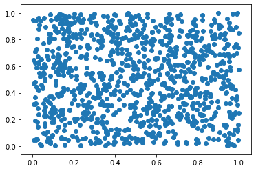

# Бог играет в кости
Начнём с простого. Достаточно часто, в условиях остутствия исходной информации (причин может быть множество, например секретность), появляется необходимость создавать случайные данные. В этом непростом упражнении мы сделаем одну простую вещь: создадим случайные данные от 0 до 1 и раскидаем их на плоскости случайным образом.


Credits: NASA/JPL-Caltech

Пусть нас вдохновляет звёзное небо. Помните, как оно завораживало в саге Джорджа Лукаса? Согласитесь, лень рисовать каждую звёздочку. Призовём же бога автоматизации. Пусть робот нарисует за нас множество точек, случайно раскиданных в пространстве.

## Библиотеки numpy и matplotlib


```python
# загружаем очень популярную библиотеку numpy, 
# из которой заберем позднее специальную функцию

import numpy as np

# также, нам понадобится библиотека создания дигарамм

import matplotlib.pyplot as plt
```

## Количество точек
Помните, мы хотим сделать что-то похожее на звёдное небо. Для начала, давайте скажем, сколько звёзд мы хотим увидеть


```python
# чтобы дважы не вводить число, 
# обозначим количество точек
# это будет переменная с именем size

size = 1000
```

## Координаты

Хоть мы и живём в многомерном пространстве, но достаточно часто пользуемся всего лишь двумя координатами. Это связано с тем, что наше мышление, экономии времени ради, ориентируется по вертикальным и горизонтальным направлющим. Когда вы смотрите на небо, то подсознательно делите мир на "выше уроня глаз", "ниже уровня глаз", "по левую руку", "по правую руку". 


Рене Декарт. Credits: André Hatala

В XVII веке Рене Декарт подарил нам прямоугольную систему координат. Теперь мы её используем и в навигации, и когда рассаживаемся по местам в театре.

Для того, чтобы нарисовать множество точек, случайно раскиданных пространстве, мы просто создаем множество также случайных координат X и Y. Главное, чтобы их количество совпадало. Для этого используется специальная функция и созданная нами переменная size.


```python
# создаём переменную X

x = np.random.sample(size)

# смотрим, что получилось

print(x)
```

    [0.35882228 0.01496531 0.52205852 0.17807237 0.02470927 0.95171313
     0.91312331 0.48388823 0.7071916  0.12700489 0.24144428 0.25525785
     0.39551174 0.57950445 0.21663764 0.17442014 0.09382113 0.79183049
     0.31019609 0.58443926 0.99110276 0.95480497 0.5387192  0.83136289
     0.04944531 0.96164167 0.46161724 0.05706038 0.06894712 0.57540361
     0.77720803 0.31517375 0.92086528 0.34715664 0.59425938 0.16680759
     0.98602515 0.37928988 0.65738084 0.8184062  0.14573429 0.20185802
     0.04865091 0.77410994 0.72568675 0.50173971 0.16188521 0.2868419
     0.47150318 0.04913022 0.32245242 0.02778273 0.51969724 0.91478083
     0.2517366  0.74795835 0.48346565 0.48670375 0.29181593 0.87006812
     0.55407666 0.38005649 0.22968889 0.23760135 0.94460582 0.82110467
     0.18784356 0.1395532  0.67222063 0.30355684 0.66715145 0.52768433
     0.61292435 0.56536162 0.00447083 0.66608698 0.88487776 0.26948881
     0.24743539 0.03591393 0.68169061 0.63890602 0.26406163 0.2606439
     0.90496812 0.30622209 0.62545944 0.70322104 0.23858656 0.50690784
     0.47498057 0.86009743 0.76670209 0.97623446 0.63716949 0.99372024
     0.64725582 0.93656306 0.69581157 0.61737303 0.28096643 0.52360877
     0.88083082 0.41862571 0.13882527 0.95821915 0.61791172 0.65945759
     0.62159914 0.92927159 0.67627386 0.50407905 0.00257777 0.25181906
     0.86403011 0.4923083  0.94210816 0.0753349  0.70796372 0.82437989
     0.01420759 0.28268815 0.09180005 0.87087508 0.01476957 0.82691639
     0.86954328 0.74593113 0.02954262 0.29620974 0.99318839 0.34432049
     0.4191642  0.75184494 0.53172141 0.21313073 0.18564653 0.80009827
     0.67319708 0.77501054 0.63992427 0.60256646 0.15387948 0.2338415
     0.63153308 0.9281733  0.79663329 0.33480142 0.11261323 0.39659006
     0.45840069 0.84395457 0.6080969  0.87284181 0.69335388 0.55786852
     0.21371947 0.26533573 0.58970207 0.43451938 0.39616497 0.23313451
     0.86324345 0.96535101 0.99408821 0.86766628 0.57721208 0.23283486
     0.63745711 0.83686638 0.54156218 0.49170873 0.8983956  0.35917025
     0.54961692 0.7915905  0.4595608  0.70246549 0.31243182 0.9999586
     0.83534343 0.20474702 0.50505161 0.69117575 0.61727175 0.64454627
     0.64474509 0.74161171 0.56365542 0.08079272 0.34456105 0.92568153
     0.73482574 0.77882741 0.32233478 0.14069425 0.23415418 0.40073902
     0.57104188 0.08728652 0.38197908 0.31780103 0.45978981 0.86242628
     0.53149224 0.53911566 0.42002561 0.30724247 0.953429   0.61047534
     0.9350073  0.5662845  0.53727388 0.45428869 0.75133355 0.8132005
     0.69075426 0.74993953 0.20808169 0.58446345 0.75497382 0.32035322
     0.12533796 0.85360854 0.9346955  0.08062091 0.35664083 0.90639265
     0.50950942 0.95406091 0.12087374 0.54738591 0.65265281 0.9416133
     0.0133933  0.39665866 0.06845948 0.32038665 0.20119885 0.41999352
     0.76203534 0.93075144 0.97431252 0.38321693 0.33099593 0.34208746
     0.69614908 0.37616078 0.05133343 0.95505107 0.65056383 0.92340221
     0.09259154 0.14872231 0.67666063 0.39385703 0.36137485 0.94543367
     0.50685303 0.09839311 0.89190602 0.5873241  0.98680847 0.74892834
     0.33286127 0.26293725 0.57764194 0.12823417 0.5181505  0.01341424
     0.11225266 0.73208212 0.29313451 0.40227713 0.14075061 0.67912609
     0.4418178  0.62528282 0.83947349 0.81884759 0.2640829  0.78744134
     0.95426427 0.77874794 0.75580377 0.41765169 0.82057536 0.36186232
     0.96726071 0.5671976  0.97096008 0.60057105 0.16408522 0.53575156
     0.56380239 0.5787076  0.76322888 0.45334765 0.15753752 0.83919872
     0.39981356 0.9565033  0.22116153 0.50172719 0.35884574 0.49484019
     0.48695747 0.96707524 0.56507039 0.7766639  0.93555809 0.46318465
     0.80902801 0.23436479 0.2382309  0.1401012  0.2546     0.66154529
     0.75757505 0.58730321 0.06032416 0.82201319 0.39993383 0.38873904
     0.49491386 0.48516358 0.15657176 0.00513695 0.37732058 0.4918567
     0.61600273 0.87798531 0.76297338 0.84111817 0.40406938 0.10068055
     0.44685018 0.77429008 0.59402498 0.02894872 0.31112765 0.51253241
     0.58107371 0.77104105 0.87674976 0.78236854 0.02007048 0.62040853
     0.61680298 0.6902581  0.37007129 0.2453067  0.76361791 0.1271328
     0.05331133 0.49717243 0.69749669 0.99280306 0.76775092 0.62574693
     0.78764287 0.77234526 0.54294915 0.79803758 0.69642975 0.50166434
     0.69465628 0.95066063 0.88400937 0.99789215 0.1712125  0.9541844
     0.35288942 0.95130431 0.63838804 0.45572156 0.53298637 0.12593733
     0.6364576  0.5951529  0.19083255 0.12463577 0.20151434 0.81020793
     0.91148461 0.15290236 0.27122757 0.27216854 0.12401476 0.90532435
     0.68307446 0.78402852 0.10537824 0.11213943 0.10614838 0.26523958
     0.88199178 0.6989377  0.76279968 0.46333752 0.32191249 0.03223923
     0.09640855 0.34141079 0.34721955 0.12562709 0.37277861 0.64736227
     0.52506667 0.49792152 0.29356184 0.23481775 0.41314198 0.28580322
     0.14917299 0.79334109 0.04242647 0.78090709 0.34417526 0.65210965
     0.5774618  0.67630115 0.21143131 0.38136798 0.74835935 0.11069645
     0.43349189 0.89407887 0.71750011 0.2839905  0.77651181 0.53622095
     0.48848093 0.41038256 0.74009499 0.82951998 0.94496561 0.77529017
     0.02439318 0.1778528  0.09599462 0.81579544 0.57478339 0.14180257
     0.04314435 0.14794845 0.93829884 0.31358176 0.28901001 0.24170963
     0.02965365 0.60828646 0.71800099 0.6180697  0.84562384 0.97404975
     0.14686028 0.87926633 0.13765187 0.7530732  0.19173208 0.17755553
     0.08491365 0.20373678 0.76024421 0.02444792 0.88317145 0.4769558
     0.46806094 0.7334573  0.8085406  0.95422593 0.1247959  0.21884849
     0.79880097 0.99911361 0.38492649 0.65576213 0.02703453 0.4979358
     0.46676539 0.47197945 0.64914335 0.97065666 0.15867141 0.91433363
     0.93909489 0.33594084 0.52966343 0.17463762 0.45455909 0.05765281
     0.31707206 0.78748448 0.85130476 0.61041873 0.28398564 0.59685527
     0.51013139 0.08674136 0.30170084 0.40592756 0.15480656 0.06248169
     0.42148057 0.59560911 0.73615446 0.28340076 0.48273946 0.07821309
     0.51274769 0.40229573 0.88591997 0.57887999 0.47822744 0.661046
     0.36327793 0.3961644  0.28342983 0.41442636 0.99990363 0.26604868
     0.06085525 0.15665302 0.67611504 0.70202597 0.47333214 0.79943195
     0.62243838 0.06336667 0.2203245  0.02816681 0.01132962 0.61299539
     0.63265299 0.0170421  0.36448214 0.37945876 0.53217782 0.2587581
     0.18889151 0.7156932  0.45526379 0.20830212 0.16883271 0.67596746
     0.20939396 0.35725471 0.13564897 0.12996207 0.31377591 0.26342777
     0.20203054 0.70986614 0.72461216 0.11635415 0.08527575 0.94379305
     0.03346627 0.11954863 0.26388652 0.46849595 0.51644057 0.58929573
     0.02009354 0.13842959 0.49526671 0.39704377 0.00499073 0.79497678
     0.05436976 0.34781638 0.95593979 0.79108631 0.0529552  0.37849031
     0.23075388 0.36675486 0.43159322 0.05348896 0.55262218 0.99129202
     0.1784027  0.74473009 0.10840218 0.59226661 0.66986574 0.65677188
     0.65299277 0.1011404  0.34819007 0.83620038 0.58611962 0.31254733
     0.33151569 0.40524071 0.24824261 0.84770616 0.50202254 0.7119103
     0.24107329 0.58463212 0.10298261 0.82363636 0.08762779 0.68685664
     0.1597252  0.5967815  0.70810731 0.84870346 0.55065233 0.32666072
     0.76284806 0.36657572 0.6145206  0.22027808 0.0130596  0.19799063
     0.5548862  0.90755474 0.71428015 0.66669747 0.0860534  0.11712107
     0.94111906 0.75247783 0.55465232 0.42215492 0.14271252 0.05894413
     0.17629886 0.18589039 0.3832187  0.04233518 0.91898936 0.38126221
     0.94093291 0.92911978 0.11005701 0.79250985 0.16719423 0.70212214
     0.85288313 0.19910905 0.45018207 0.09035483 0.08440188 0.65555277
     0.82773234 0.90513738 0.14846331 0.53690735 0.14618633 0.44239987
     0.35830929 0.50390527 0.61116612 0.13496821 0.02114143 0.67663113
     0.57570871 0.14536873 0.66263573 0.66181413 0.7717225  0.78489332
     0.90277374 0.56123025 0.38745304 0.02961622 0.29769333 0.95515725
     0.56860674 0.12170009 0.8040733  0.60723144 0.33692776 0.77710209
     0.58145479 0.39402772 0.08720835 0.97551384 0.86375279 0.24522812
     0.19684197 0.71255818 0.67041679 0.12091771 0.86515047 0.67030256
     0.78614167 0.48817491 0.43191562 0.51624431 0.11178977 0.78719072
     0.7319816  0.42137429 0.65281012 0.55679898 0.85597402 0.07266192
     0.94768529 0.17689679 0.53579361 0.15944388 0.58064642 0.66696034
     0.17036494 0.78870916 0.9452962  0.83293614 0.36353702 0.772409
     0.06847305 0.78865299 0.1274141  0.78085676 0.45459007 0.38953043
     0.04260002 0.10966198 0.05929189 0.80648759 0.08043278 0.38291287
     0.40246162 0.20058574 0.66410191 0.8991179  0.99673743 0.65282945
     0.39090391 0.44267092 0.9707987  0.47213348 0.73630822 0.49690406
     0.34459178 0.22953985 0.82747915 0.73043002 0.4401825  0.27356507
     0.01285595 0.33282572 0.10238608 0.01824156 0.40870124 0.47215568
     0.28009993 0.06301529 0.6419711  0.27695737 0.57943091 0.64302083
     0.43383644 0.26945498 0.28593838 0.07514318 0.72071202 0.19692995
     0.43318723 0.64278158 0.45613123 0.53911849 0.79329063 0.25155152
     0.02942624 0.5093616  0.81103578 0.05591212 0.55897606 0.34053258
     0.94588429 0.32029561 0.67751923 0.85473813 0.05778675 0.32283818
     0.85994097 0.59729472 0.92128208 0.35196285 0.5524987  0.72162471
     0.62831528 0.17443396 0.42479131 0.15732211 0.66641784 0.87834765
     0.88468304 0.33863353 0.9782709  0.36233988 0.32700149 0.38031056
     0.31679621 0.06261758 0.68727569 0.83632501 0.28579202 0.30987822
     0.14170709 0.0054571  0.46977687 0.66056176 0.92605805 0.66399986
     0.53036428 0.33488646 0.8139453  0.32918825 0.5766713  0.17138682
     0.74530651 0.98156589 0.24217869 0.04009932 0.51546656 0.26196477
     0.7359685  0.63589388 0.08135841 0.10030854 0.02275496 0.56942305
     0.51329998 0.82739794 0.15321334 0.53484862 0.98863355 0.35935877
     0.4107031  0.17509217 0.37446596 0.1495043  0.17902312 0.98390982
     0.25719049 0.08914911 0.98743125 0.23736092 0.06181913 0.11701448
     0.06313911 0.63646328 0.85764831 0.04442178 0.03665815 0.71447635
     0.66958058 0.9606143  0.09666085 0.40218537 0.47963735 0.88552474
     0.55081131 0.32649919 0.49065035 0.3661986  0.42710513 0.93811159
     0.55133036 0.49116193 0.97446992 0.4687752  0.73943096 0.72334911
     0.56595527 0.11931439 0.54543818 0.21841469 0.49356079 0.13496308
     0.49932938 0.82400021 0.80826914 0.58216966 0.63601055 0.56099767
     0.39434846 0.656281   0.43603124 0.57025009 0.66420918 0.85725385
     0.45929132 0.74622215 0.81804394 0.26194935 0.0441702  0.86673092
     0.6722755  0.74187105 0.91345418 0.7507904  0.7528838  0.91060283
     0.3031097  0.96311756 0.8724925  0.95622555 0.41652535 0.49000925
     0.71972975 0.09979693 0.98402114 0.47339016 0.08882691 0.1345692
     0.33708406 0.14609113 0.18863257 0.08591437 0.5792078  0.38801529
     0.78305739 0.84103787 0.67294534 0.79396397 0.93364176 0.71050173
     0.72418297 0.17376554 0.54445525 0.4767723  0.11602472 0.77308687
     0.62487294 0.12832834 0.15498134 0.65820492 0.56114924 0.73230214
     0.90102184 0.31353622 0.01730011 0.61459225 0.51914379 0.26728255
     0.36385271 0.89730243 0.14811124 0.60060852 0.29519371 0.4034078
     0.37066249 0.38868128 0.67232572 0.07586669 0.05722934 0.20959072
     0.67228468 0.09206722 0.87482027 0.74698557 0.17885938 0.45470738
     0.32500181 0.28179017 0.13100635 0.2299513  0.13157378 0.35721163
     0.15554344 0.55993723 0.24157834 0.53201891 0.99705738 0.44487355
     0.33210218 0.06695638 0.21137124 0.46517047 0.05977683 0.92884275
     0.52224538 0.38534986 0.93782055 0.80817162 0.81504421 0.56438705
     0.72123565 0.51132203 0.18084423 0.8316504  0.30116305 0.41235619
     0.28570849 0.92538696 0.66191244 0.16234321 0.77917996 0.65248361
     0.33538602 0.23169313 0.02276014 0.4745486 ]
    


```python
# создаём переменную Y

y = np.random.sample(size)

# смотрим, что получилось

print(y)
```

    [0.64345181 0.04956017 0.23019435 0.58914096 0.2817102  0.25592538
     0.43482019 0.90756365 0.24542696 0.14230804 0.24551911 0.22992979
     0.88017513 0.85428442 0.20881989 0.77074693 0.06977884 0.79469161
     0.91328134 0.80602062 0.69781458 0.92773854 0.54860884 0.27972658
     0.58764815 0.21526865 0.9999153  0.54189062 0.03736259 0.39536912
     0.21989069 0.42069704 0.4351785  0.46420261 0.5661778  0.75725652
     0.89428312 0.91077011 0.62818032 0.11771417 0.24053574 0.3814273
     0.43353116 0.15923545 0.42428337 0.75035901 0.94045318 0.2244673
     0.31056411 0.44447841 0.78865807 0.95814617 0.04562723 0.5672713
     0.25802055 0.7133543  0.95815486 0.53404232 0.10549002 0.15117174
     0.296847   0.12273218 0.74663929 0.81138197 0.76432317 0.67132616
     0.31889285 0.3817559  0.82875711 0.36321589 0.51050862 0.84661852
     0.09729888 0.3620758  0.6452478  0.73423367 0.6821278  0.73689107
     0.43464675 0.01338128 0.06428289 0.45989632 0.55097428 0.5414147
     0.88447093 0.9282812  0.46359857 0.02981986 0.21110058 0.05778399
     0.51406338 0.39171035 0.77873004 0.23864904 0.35969083 0.31113946
     0.1624278  0.40014268 0.7260003  0.53797142 0.53779158 0.17026305
     0.95195653 0.27379915 0.05404871 0.23071852 0.08345798 0.38395406
     0.34476942 0.73675329 0.50418578 0.38777518 0.94942852 0.85106239
     0.37609526 0.29310913 0.75418139 0.65445353 0.95767421 0.190799
     0.31715522 0.93108898 0.27194223 0.82638496 0.32129426 0.69059201
     0.70625883 0.77632463 0.63302508 0.25034982 0.12898498 0.97744238
     0.12481458 0.83095537 0.04820511 0.06452731 0.52659083 0.13343082
     0.30057042 0.87612831 0.2626636  0.26876088 0.11666921 0.46771474
     0.20451122 0.51037039 0.44073476 0.50165602 0.88786762 0.03605328
     0.12846282 0.72075425 0.50361882 0.5466875  0.7383606  0.43591716
     0.81235152 0.7472168  0.26265802 0.62699952 0.07297038 0.00468014
     0.86557797 0.01462923 0.11092455 0.33239793 0.79744314 0.98750641
     0.4780647  0.35475575 0.72852341 0.2344921  0.9974704  0.35475122
     0.10043297 0.05158432 0.89731399 0.98069811 0.20609179 0.57447136
     0.50908841 0.18545492 0.87216477 0.09402124 0.39633958 0.03711998
     0.17179811 0.31577945 0.53349346 0.80635731 0.53004585 0.15760162
     0.31606742 0.15229367 0.04100414 0.5949401  0.44505553 0.41773654
     0.15457599 0.98786772 0.30643409 0.39906346 0.68834359 0.49512029
     0.02256472 0.67561588 0.35318254 0.06213678 0.0978128  0.86254842
     0.8481279  0.58369236 0.27644642 0.05079644 0.63100197 0.79524004
     0.61063819 0.21574618 0.1145506  0.10115453 0.83144991 0.79416646
     0.57159478 0.75354162 0.68405667 0.84430233 0.10201501 0.10172337
     0.8170953  0.63440738 0.65314917 0.78023038 0.87428718 0.40438526
     0.19340732 0.39016415 0.67863904 0.04530893 0.93264806 0.94227358
     0.444721   0.80184702 0.24177384 0.50495352 0.3988445  0.22972159
     0.40103568 0.6838032  0.09816294 0.46438108 0.9324963  0.47591956
     0.37016144 0.80623353 0.17102221 0.23979146 0.08491438 0.49880968
     0.22953895 0.59084442 0.6101443  0.03279894 0.34734099 0.23596259
     0.82189109 0.88171058 0.20175446 0.67726748 0.38579813 0.62614459
     0.4896812  0.32238451 0.9696167  0.25282353 0.19644958 0.11128085
     0.02146213 0.60702754 0.19489328 0.81475513 0.28900651 0.68967678
     0.67379459 0.93951046 0.18792706 0.09001919 0.51239287 0.85671987
     0.21173241 0.14961948 0.99304974 0.25713818 0.80271772 0.18101216
     0.32532546 0.09985433 0.36745471 0.60311266 0.61471364 0.6818206
     0.03215619 0.59404279 0.94770411 0.03162456 0.18094365 0.81487351
     0.63329714 0.36066532 0.46589397 0.31797864 0.31804278 0.99940898
     0.62008204 0.66826564 0.43020792 0.24819827 0.06073154 0.83732917
     0.58013641 0.49214457 0.49378685 0.49675115 0.78286963 0.89619753
     0.60685818 0.48997046 0.86447102 0.3142918  0.50289821 0.8383696
     0.23270845 0.05277221 0.86368743 0.29028655 0.98628494 0.36190224
     0.05358259 0.73408269 0.30805163 0.42109319 0.17477978 0.52615308
     0.19548731 0.36826711 0.55650313 0.5472756  0.4461726  0.91082733
     0.70244925 0.67514491 0.46413372 0.30779949 0.71071729 0.85943465
     0.32189906 0.97384929 0.74749698 0.99820335 0.72969533 0.37771489
     0.39037729 0.8288547  0.59265102 0.27411577 0.52191865 0.51245488
     0.69730721 0.02521524 0.5427315  0.04380033 0.87980383 0.88338106
     0.00633425 0.06344773 0.89656762 0.04794637 0.05707473 0.2297607
     0.64853428 0.05882582 0.56751583 0.53920722 0.99638424 0.31019398
     0.83706307 0.62190616 0.74028504 0.40032852 0.68845265 0.52112724
     0.0656815  0.81625575 0.61537723 0.46126568 0.80572045 0.75974779
     0.50156311 0.22786258 0.55631996 0.6057024  0.36812131 0.91006175
     0.71595756 0.42824907 0.30394986 0.58238623 0.85947038 0.95690534
     0.41660271 0.38842111 0.36486318 0.87698712 0.76323375 0.14387888
     0.53368942 0.17987092 0.65466394 0.32136565 0.42456994 0.96299656
     0.07874669 0.71152848 0.50381218 0.71073311 0.83357108 0.00386328
     0.72967474 0.54354707 0.21262173 0.9775285  0.28169032 0.16953743
     0.22418058 0.81154989 0.38613127 0.3211427  0.00323312 0.48127621
     0.42353388 0.17737029 0.0820848  0.23356114 0.33400884 0.23816848
     0.45988362 0.84628322 0.14273032 0.83787179 0.54845437 0.05821467
     0.23969283 0.57293295 0.98686532 0.78485045 0.47328121 0.68527102
     0.5632192  0.22747155 0.989103   0.18860216 0.07846419 0.6602902
     0.25483621 0.34993281 0.43399931 0.67263463 0.83895007 0.97178449
     0.01941301 0.49612234 0.243763   0.45644434 0.73495354 0.3108407
     0.32770471 0.85034439 0.71031107 0.68454611 0.14448921 0.05986183
     0.12188775 0.94702629 0.76016028 0.8725281  0.97501395 0.90298943
     0.15378871 0.33860665 0.77881677 0.97147026 0.87197533 0.96085696
     0.43115196 0.42557495 0.59309642 0.08939398 0.02176146 0.65072227
     0.38064469 0.21519417 0.66615813 0.55120948 0.05361834 0.29333773
     0.41212375 0.66169984 0.51725173 0.19967204 0.29925062 0.78181013
     0.98337785 0.09153683 0.25283408 0.75985709 0.06099806 0.29996399
     0.86855024 0.41135673 0.8356766  0.69966348 0.24897742 0.24738137
     0.50488217 0.15944164 0.6864049  0.61307102 0.42428921 0.04760275
     0.59222742 0.89672305 0.04815792 0.62311679 0.47882006 0.30185268
     0.37828211 0.04729963 0.26608312 0.39095702 0.16055612 0.65851387
     0.74340243 0.24331324 0.72337145 0.71099678 0.42977607 0.38865159
     0.58296729 0.116491   0.61362458 0.63280456 0.72949361 0.58800123
     0.20799121 0.21170745 0.86279017 0.63238214 0.0369965  0.96047789
     0.54663922 0.5605472  0.20464784 0.0738172  0.63568083 0.79721887
     0.58969024 0.06468854 0.92267674 0.9887933  0.04654442 0.86078898
     0.61762253 0.87992175 0.89156929 0.40248798 0.76997517 0.84396458
     0.84621386 0.93593868 0.69628038 0.55426214 0.46157086 0.37371978
     0.5743719  0.48675286 0.27290222 0.29332525 0.83448587 0.21531675
     0.54762356 0.1824903  0.06187738 0.40590835 0.23944556 0.36734431
     0.74459692 0.12768139 0.19584514 0.40187329 0.33291119 0.29557357
     0.34604259 0.94240721 0.2086214  0.94970443 0.31938955 0.4803736
     0.64394756 0.89735113 0.35812392 0.7232735  0.78525779 0.52461682
     0.37732477 0.89792641 0.09716317 0.96507643 0.70776461 0.96667675
     0.99596017 0.81919025 0.52937953 0.59316777 0.80320926 0.95535852
     0.56180891 0.70723268 0.26458147 0.77696009 0.88341199 0.25171715
     0.78744276 0.91531923 0.78546704 0.0035078  0.52204944 0.64943862
     0.04050997 0.08360132 0.86990769 0.4411568  0.92350593 0.01695705
     0.06202029 0.74944531 0.81631046 0.9465306  0.53032587 0.10730287
     0.65261498 0.68866068 0.41613622 0.81610245 0.9208132  0.31129351
     0.44344522 0.1862466  0.27129517 0.3996011  0.18226911 0.42707122
     0.47049027 0.98511554 0.86727357 0.72069526 0.30423701 0.63303697
     0.9109719  0.64532126 0.94715074 0.88279748 0.80029729 0.88209974
     0.7784519  0.65581998 0.02510266 0.66428941 0.80333556 0.70318737
     0.2508511  0.01677653 0.84525346 0.00669468 0.51779458 0.95316626
     0.83898151 0.20249613 0.95378417 0.39306026 0.20678204 0.5819648
     0.95064447 0.39805364 0.06128103 0.84133564 0.56109091 0.66751615
     0.59832826 0.58208567 0.17135553 0.96914387 0.71989152 0.1095653
     0.00299804 0.82117248 0.73648849 0.69476598 0.39896935 0.19284738
     0.77939915 0.90591879 0.69548106 0.14882414 0.45460214 0.17452296
     0.7256287  0.8351663  0.37597656 0.59464189 0.65358543 0.6143608
     0.54465682 0.25553942 0.17164646 0.64579296 0.0358975  0.52657081
     0.0858968  0.42099279 0.78336858 0.28947486 0.73899731 0.43606373
     0.62651586 0.47839939 0.45218932 0.65620641 0.68376119 0.29164119
     0.13725883 0.15785567 0.86444797 0.32499862 0.38488704 0.33322039
     0.36471333 0.55056723 0.90082947 0.7313664  0.45486237 0.28791514
     0.03641789 0.09268928 0.18914606 0.95045226 0.79290304 0.82497847
     0.80614076 0.25203802 0.54836568 0.06098256 0.38097418 0.8167378
     0.56772251 0.15885053 0.40080554 0.62281164 0.82953664 0.45812233
     0.96129353 0.58169147 0.37605211 0.22932842 0.19332506 0.16495552
     0.768496   0.02934887 0.37818844 0.29524046 0.15014836 0.5490305
     0.37350977 0.15854306 0.63512874 0.44749079 0.24835195 0.36558691
     0.76445327 0.04627804 0.9236464  0.0086993  0.60704597 0.76774834
     0.92957337 0.22320712 0.74735148 0.97555388 0.31650074 0.84703256
     0.18145155 0.59344332 0.57169483 0.37649153 0.5102489  0.45598892
     0.94659134 0.47023058 0.69267854 0.95003939 0.62733182 0.99271668
     0.52100532 0.75773258 0.3975488  0.77546767 0.72017941 0.89118164
     0.21239953 0.12142904 0.93257951 0.94012698 0.52643761 0.68831539
     0.73696121 0.37571974 0.37422773 0.67034655 0.80802265 0.29633743
     0.70202302 0.23330518 0.20543157 0.88244175 0.99347112 0.3112395
     0.72755726 0.85705044 0.44900745 0.41480423 0.2759606  0.25433638
     0.67333299 0.24945068 0.76534598 0.67685195 0.35270825 0.96842536
     0.59821247 0.02173399 0.71514582 0.53740545 0.52173719 0.87139502
     0.79611647 0.57138472 0.24342238 0.89503641 0.80073576 0.81429385
     0.82069626 0.65455689 0.60786471 0.02081542 0.52371815 0.45097002
     0.4720998  0.58094736 0.08656374 0.8679367  0.55153473 0.60816182
     0.50319042 0.85209549 0.77587076 0.43463161 0.25097053 0.60507155
     0.91393772 0.98531003 0.61524513 0.07926101 0.65738503 0.46980214
     0.81825822 0.27384748 0.81313779 0.09158666 0.81105383 0.1575018
     0.45993814 0.42025913 0.23932287 0.3839504  0.58881633 0.91121474
     0.95792607 0.03216831 0.83636164 0.39129029 0.62978569 0.61857454
     0.01865202 0.43373645 0.80931423 0.32075544 0.4870341  0.30939393
     0.22917665 0.29284332 0.42551632 0.19402709 0.81354665 0.26639735
     0.18482708 0.27437821 0.40691571 0.02153876 0.86172884 0.71025606
     0.19848344 0.01860369 0.91445782 0.02139982 0.8015246  0.82305667
     0.93904198 0.55573191 0.90917869 0.21313417 0.11133596 0.60563262
     0.79016076 0.98960695 0.96433203 0.64569334 0.28512112 0.27065621
     0.05187104 0.10369441 0.94103013 0.14374661 0.95799893 0.31276006
     0.09782466 0.33842244 0.44073282 0.1936149  0.49732651 0.77421395
     0.30377523 0.84412112 0.42987243 0.33849972 0.26666636 0.83852773
     0.52322106 0.18127939 0.12954479 0.01871152 0.92644553 0.98668519
     0.03273786 0.29333849 0.96251016 0.405279   0.92301135 0.41952431
     0.58788264 0.08690259 0.45067696 0.94316264 0.16217505 0.11776678
     0.31327896 0.22700842 0.52936108 0.79967179 0.59331208 0.83902628
     0.15108464 0.72168633 0.5405061  0.67051131 0.71833392 0.29704281
     0.56604423 0.53564902 0.2680709  0.75308554 0.99226701 0.84192106
     0.83825927 0.69025591 0.43628978 0.69631006 0.92384543 0.54446195
     0.78759226 0.93119179 0.05156495 0.92785892]
    

## Неслучайная случайность

Вернемся к нашему зрительному восприятию. Наш мозг приучен эволюцией группировать точки и видеть в них узнаваемые формы.


Пример: сначала мы не видим долматинца, но если вглядется, то начинаем его замечать. Существует научное направление — гештальтпсихология, которое анализирует и объясняет подобную работу нашего мозга. Возможно, объяснение связано с большей выживаемостью наших предков лучше определявших добычу или опасность в листве.


Credit: Celestial map from 1670, by the Dutch cartographer Frederik de Wit. Scanned by Janke

Но самое интересное, это то, что люди стали видеть знакомые образы там, где их не было. С появлением устной речи, группы звёзд на небе обрели форму и имена.

Настало время визуализировать наши координаты и посмотреть на них, как на пятно Роршарха.


```python
# вызываем самым простым образом функцию постоения точечной диаграммы

plt.scatter(x,y)

# смотрим и видим то, что подказывает нам подсознание

plt.show()
```




